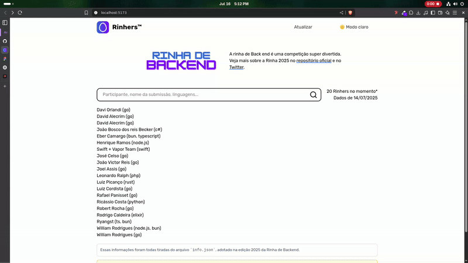
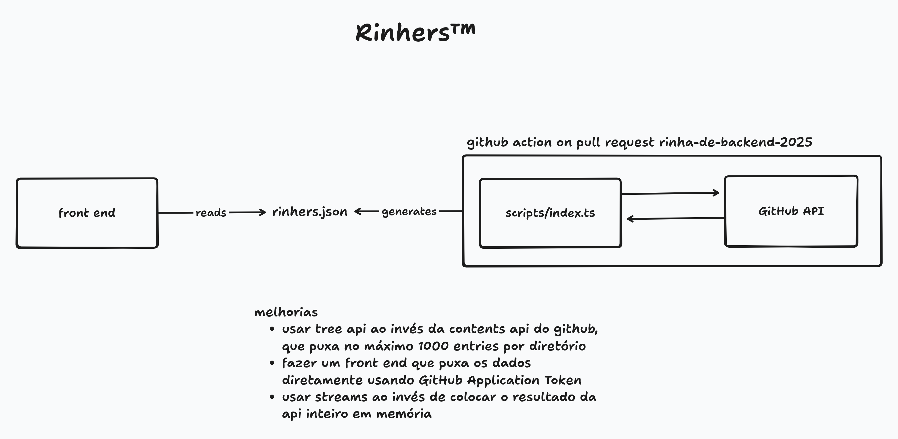

# Rinhers™

[](https://rinhers.kauefraga.dev)
[](https://github.com/kauefraga/rinhers/blob/main/LICENSE)
[](https://github.com/kauefraga/rinhers)

Conheça os participantes e suas soluções da [Rinha de Back end 2025](https://github.com/zanfranceschi/rinha-de-backend-2025), a competição mais aguardada do ano!

<div align="center">



</div>

## Como rodar localmente

Tenha o [bun](https://bun.sh) instalado na sua máquina. Node.js e NPM também funciona.

Primeiro clone o projeto e instale as dependências

```sh
git clone https://github.com/kauefraga/rinhers.git

cd rinhers

bun install
```

Inicie o front end em modo de desenvolvimento

```sh
bun dev
```

Execute o script que gera o arquivo `rinhers.json`

```sh
bun gen
```

> [!WARNING]
> Para executar o script é necessário preencher a variável de ambiente `GITHUB_AUTH_TOKEN` com [um token de acesso pessoal](https://docs.github.com/pt/authentication/keeping-your-account-and-data-secure/managing-your-personal-access-tokens#como-criar-um-personal-access-token-classic) que tenha a permissão `public_repo`.

```sh
echo "GITHUB_AUTH_TOKEN=" > .env
```

## Funcionamento do projeto



O front end lê o arquivo `rinhers.json`, que é gerado e adicionado ao bundle da aplicação (`import`).

Analisando a trajetória até os dados foi possível definir que seria melhor gerar um arquivo com todos os dados uma única vez, ao invés de consumir a API do GitHub diretamente a cada requisição para página (mesmo com cache).

O script faz uma chamada para o endpoint `https://api.github.com/repos/zanfranceschi/rinha-de-backend-2025/contents/participantes` para conhecer todos os diretórios que existem e depois mapear eles para URLs `https://raw.githubusercontent.com/zanfranceschi/rinha-de-backend-2025/main/participantes/{submissao}/info.json`.

As URLs são separadas em chunks, depois os arquivos json são consultados usando `fetch` e `Promise.allSettled`. Os resultados são agregados em memória.

No final o resultado é convertido no arquivo `rinhers.json`.

Novas versões do arquivo vão ser geradas automaticamente quando um usuário abrir uma issue neste repositório com a tag `update-rinhers`, a qual vai disparar o pipeline do GitHub Actions.

###### Melhorias

- **Trees API**: A API do GitHub em uso é chamada de *Contents API*, ela puxa no máximo 1000 registros por diretório, ou seja, se a Rinha vier a ter mais de 1000 participantes o excedente não vai ser incluso. Pelo que pesquisei a *Trees API* não tem essa limitação.
- **Streams**: Usar streams e escrever os resultados no arquivo `rinhers.json` sob demanda é mais eficiente e escalável do que colocar os resultados direto na memória.

### Tecnologias

- [TypeScript](https://www.typescriptlang.org/) 💙
- [Bun](https://bun.sh/)
- [GitHub API](https://docs.github.com/pt/rest)
- [React](https://react.dev/)
- [TailwindCSS](https://tailwindcss.com/)
- [Lucide](https://lucide.dev/icons/)
- [Cloudflare Pages](https://pages.cloudflare.com/)

O ícone do projeto foi feito usando [ray.so](https://ray.so/icon).

## Contribuições

Fique à vontade para contribuir [abrindo uma issue](https://github.com/kauefraga/rinhers/issues/new) para reportar um bug, sugerir uma alteração na interface, uma melhoria ou uma nova funcionalidade.

### Como contribuir

1. Faça um *fork* do projeto
2. Clone seu *fork* na sua máquina
3. Prepare o [ambiente de desenvolvimento](#como-rodar-localmente)
4. Faça as alterações e *commit* elas com [mensagens descritivas](https://www.conventionalcommits.org/pt-br/v1.0.0/)
5. Sincronize as alterações com o repositório do seu *fork* (`git push`)
6. Abra um *pull request* especificando o que você fez de forma geral (considerando que as alterações têm seus *commits* descritivos)

## Licença

Este projeto está sob a licença MIT - Veja a [LICENÇA](LICENSE) para mais informações.
